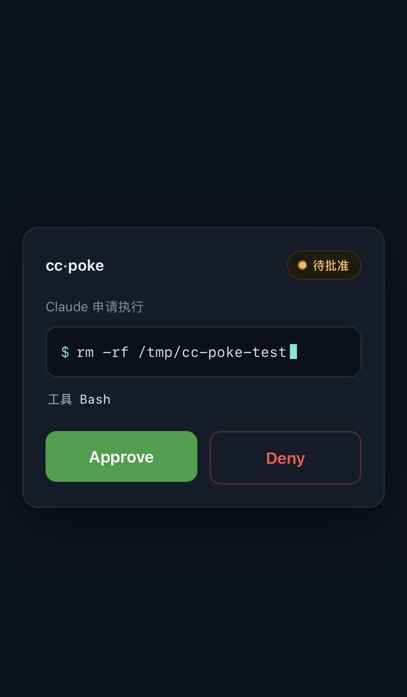

# cc-poke

[](https://github.com/eatingzhang0611/cc-poke/actions/workflows/ci.yml)
[](LICENSE)

**English** | [中文](README.zh-CN.md)

Get a push on your phone when Claude Code stops for a permission prompt — and
approve or deny it from there, so Claude Code keeps going without you switching
back to the terminal. Self-hosted: the only thing that leaves your machine is a
short notification, sent through a push service you choose.

## Features

- **Self-hosted, low trust.** No cc-poke cloud. The only thing sent out is one
  notification, over a push service (ntfy or Bark) that you control.
- **Two-way, not just alerts.** Tap Approve/Deny on the phone and the decision
  flows back to Claude Code — no trip back to the terminal.
- **Fail-safe by design.** If the push fails, the network drops, or no one
  answers in time, the hook exits without a decision and Claude Code falls back
  to its normal terminal prompt. It can never leave you stuck.
- **Pluggable push.** ntfy (default, with inline Approve/Deny buttons) or Bark
  for iOS. A new channel is one small adapter class.
- **Quiet by default.** An allowlist silences routine commands, so only the ones
  that matter reach your phone.
- **Tiny.** Pure Python standard library, zero runtime dependencies; the daemon
  idles at a few MB of RAM.

## How it works

cc-poke is two hooks and one small daemon. Use just the first piece, or both.

- **Notify** — `cc-poke-notify` runs on each Claude Code *Notification* event,
  sends one push, and exits. Enough if you only want to know Claude is waiting.
- **Remote approve** — `cc-poke-approve` runs *before* a tool executes. It hands
  the request to the long-running `cc-poke-daemon` and blocks. The daemon pushes
  a notification with Approve/Deny, waits for your tap on its webhook, and
  returns the decision to the hook, which tells Claude Code to allow or deny.

```
                  ┌────────────────── your machine ──────────────────┐
  Claude Code ──▶ │  approve hook ──▶ daemon ──┐                      │
       ▲          │       ▲                     │ push                │
       │ allow/   │       │ decision            ▼                     │
       │ deny     │       └──────── webhook ◀── reverse proxy ◀───────┼──▶ phone
       └──────────┤                  (HTTPS)                          │    (tap)
                  └───────────────────────────────────────────────────┘
```

The notify path is just the hook and a push — no daemon, no proxy. Remote
approve adds the daemon (holds the pending decision, serves the approval page
and webhook) and an HTTPS reverse proxy in front of it.

**Fail-safe.** Every failure mode — push down, network gone, timeout — ends with
the hook exiting and no decision, so Claude Code uses its own terminal prompt.

## The approval page

Tapping the notification opens a page that shows the exact command before you
decide. Open [`assets/approval-page.html`](assets/approval-page.html) for a live
preview.



## Requirements

- Python 3.10+ (`sudo apt install python3-venv` on Debian/Ubuntu if needed).
- A push app on your phone: **ntfy** (default) or **Bark** (iOS).
- Remote approve only: Linux with a systemd user session, and an HTTPS reverse
  proxy in front of the daemon.

## Install

```bash
git clone git@github.com:eatingzhang0611/cc-poke.git
cd cc-poke
./install.sh
```

`install.sh` is idempotent: it creates a virtualenv, installs the package,
writes `~/.config/cc-poke/config.json` with a generated `webhook_secret`, and
installs the systemd user unit (without starting it). It prints the remaining
steps and never touches your Claude Code settings. Edit the config before use.

## Push channels

Pick a backend with the `adapter` field. The default, **ntfy**, is open source,
self-hostable, and its notifications carry inline Approve/Deny buttons. Works on
iOS, Android, and desktop.

```json
{ "adapter": "ntfy", "ntfy_server": "https://ntfy.sh", "ntfy_topic": "a-long-random-string" }
```

**Bark** is an iOS alternative. It has no inline buttons, so Approve/Deny happen
on the page opened by tapping the notification. Install the app, copy its device
key, then:

```json
{ "adapter": "bark", "bark_server": "https://api.day.app", "bark_device_key": "your-device-key" }
```

> **No banners on iOS? It's almost always the network, not ntfy.** Both ntfy and
> Bark deliver background notifications through Apple's APNs, which uses a
> long-lived connection on port 5223. Some Wi-Fi networks allow web traffic
> (80/443) but block 5223, so no APNs-based app gets background banners on them.
> Test on cellular or a VPN — if banners come back, the Wi-Fi is the cause and
> switching adapter won't help.

## Configuration

`~/.config/cc-poke/config.json` — see [`config.example.json`](config.example.json).

| Field | Used by | Meaning |
|-------|---------|---------|
| `adapter` | all | `"ntfy"` or `"bark"`. |
| `ntfy_server` / `ntfy_topic` | ntfy | Server and topic. Treat the topic as a password — long and random. |
| `bark_server` / `bark_device_key` | bark | Bark server and your device key. |
| `daemon_url` | approve hook | Where the hook reaches the daemon. Default `http://127.0.0.1:8787`. |
| `public_base_url` | daemon | Your public HTTPS address, e.g. `https://poke.example.com`. |
| `webhook_secret` | daemon | Shared secret guarding the webhook. Generated by `install.sh`. |
| `allowlist` | approve hook | Regexes for Bash commands to allow silently (no push). See [Security](#security). |
| `wait_seconds` | daemon | How long to wait for a phone decision before falling back. Default 300. |

## Notifications

Merge [`hooks/notification-settings.example.json`](hooks/notification-settings.example.json)
into your Claude Code settings (`~/.claude/settings.json` or a project
`.claude/settings.json`), using the absolute `cc-poke-notify` path that
`install.sh` printed. Check it:

```bash
echo '{"message":"hello from cc-poke","cwd":"/tmp"}' | .venv/bin/cc-poke-notify
```

Your phone should get a notification titled `cc-poke: Claude needs you`.

## Remote approval

**1. Configure.** Set `public_base_url` to your HTTPS address. Optionally fill
`allowlist` so routine commands run without a push.

**2. Reverse proxy — expose only `/webhook` and `/d`.** Keep `/requests` private
(the hook calls it on localhost).

Caddy:

```
poke.example.com {
    @public path /webhook /d
    handle @public { reverse_proxy 127.0.0.1:8787 }
    respond 404
}
```

nginx:

```nginx
server {
    listen 443 ssl;
    server_name poke.example.com;
    location = /webhook { proxy_pass http://127.0.0.1:8787; }
    location = /d       { proxy_pass http://127.0.0.1:8787; }
    location /          { return 404; }
}
```

**3. Start the daemon.**

```bash
systemctl --user enable --now cc-poke-daemon
```

**4. Register the approve hook.** Merge
[`hooks/pretooluse-settings.example.json`](hooks/pretooluse-settings.example.json)
into your settings, using the `cc-poke-approve` path. The matcher is
`Bash|Edit|Write` by default — narrow it to `Bash` if you only want shell
commands gated.

> **Timeout rule.** The hook's `timeout` must be at least `wait_seconds + 30`,
> or Claude Code kills the hook before cc-poke can fall back to the terminal. If
> you raise `wait_seconds`, raise the hook `timeout` too.

**End-to-end check.** In an interactive `claude` session, run a command not in
your allowlist (e.g. `rm -rf /tmp/cc-poke-test`). The phone gets Approve/Deny →
tap Approve → the command runs with no terminal prompt.

## Security

- `/webhook` runs a tool when tapped, so it is sensitive. It is guarded by an
  unguessable `request_id`, the shared `webhook_secret` (constant-time compare),
  and being one-shot — a decision is consumed once and the request then expires.
- Serve everything over HTTPS and keep `webhook_secret` private.
- Anyone who can read your ntfy topic can see the command in the notification.
  Treat the topic itself as a secret.
- Expose only `/webhook` and `/d`. Never expose `/requests`.
- The `allowlist` is matched against the full command with `re.search`. Anchor
  every pattern (`^...$`) **and** exclude shell metacharacters (`; & | < > $ ( )`
  and backticks) in the argument part. A loose pattern like `^ls( .*)?$` also
  matches `ls && rm -rf x`, which would then run with no push.

## Uninstall

```bash
./uninstall.sh           # stop and remove the daemon unit
./uninstall.sh --purge   # also remove the venv and config
```

It does not edit your Claude Code settings — remove the cc-poke hook entries
yourself.

## Development

```bash
.venv/bin/python -m pip install -e ".[dev]"
.venv/bin/python -m pytest -q
```

No runtime dependencies; standard library only. Tests cover the config,
adapters, decision store, daemon, hooks, and entry points.

## License

MIT — see [LICENSE](LICENSE).
